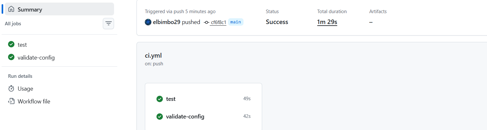
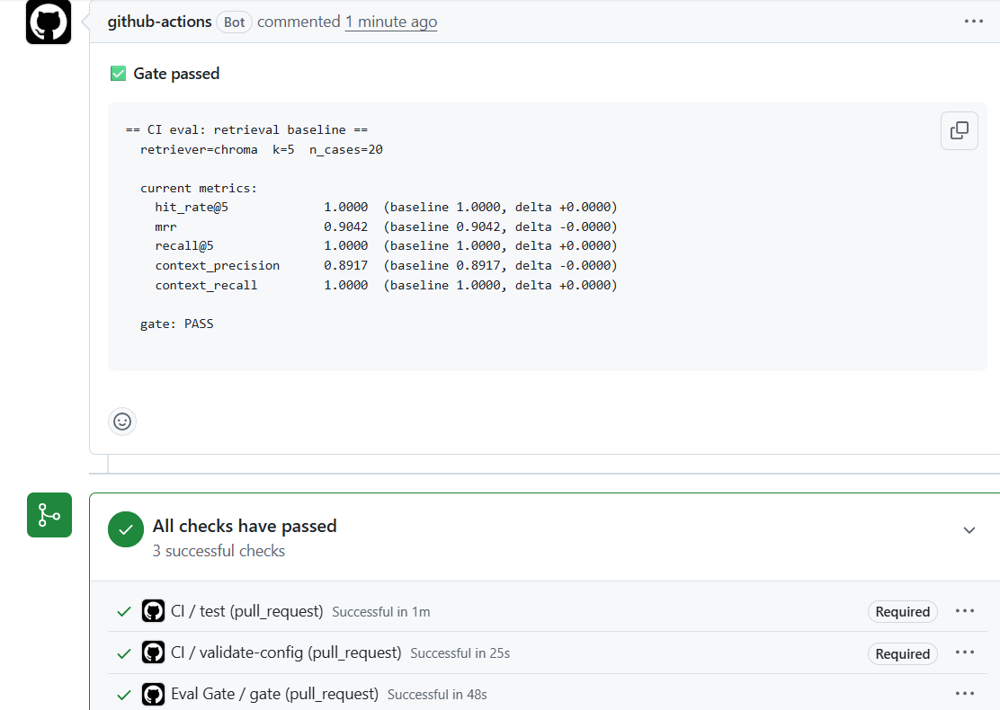
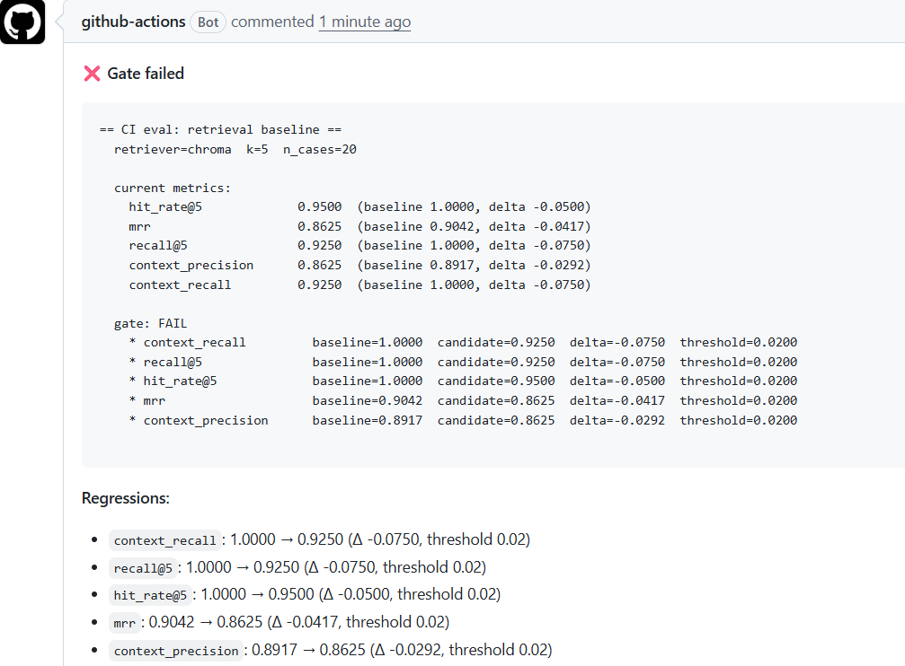

# RAGGate AI

**An automated evaluation harness and regression gate for production RAG pipelines.**

RAGGate AI scores the retrieval and generation quality of a RAG pipeline against a golden dataset, then enforces a regression gate in CI — so quality drops are caught before they ship.

[](https://github.com/elbimbo29/raggate-ai/actions/workflows/ci.yml)
[](https://github.com/elbimbo29/raggate-ai/actions/workflows/eval.yml)

**Try it in one command:**

```bash
git clone git@github.com:elbimbo29/raggate-ai.git
cd raggate-ai && uv sync --extra dev
bash scripts/demo_gate.sh
```


> **Status:** Phases 0–7 complete. Dataset, scoring, HTTP service, regression gate, dashboard, and CI integration all shipped.

---

## Why

RAG pipelines degrade silently. A prompt tweak, an embedding model swap, or a chunker change can quietly tank answer quality without breaking a single test. RAGGate AI turns "does this RAG pipeline still work?" into a measurable, enforceable signal:

- **Scores** retrieval (hit-rate@k, MRR, context precision/recall) and generation (faithfulness, answer relevancy, correctness).
- **Gates** quality regressions by comparing a candidate run to a baseline against configurable thresholds.
- **Blocks** merges in CI when quality drops.

---

## What works today

| Layer | What's built |
|---|---|
| **Dataset** | 20-case golden set over an 18-chunk AcmeDB corpus, validated by CLI |
| **Retrieval** | hit-rate@k, MRR, recall@k, context precision, context recall — with hand-computed tests |
| **Generation** | faithfulness, answer relevancy, answer correctness — DeepEval judge, cross-checked against RAGAS |
| **Retrievers** | keyword baseline (negative control) and Chroma + MiniLM embeddings |
| **Service** | FastAPI with run persistence, background execution, list/fetch, compare, and gate endpoints |
| **Gate** | configurable thresholds, CLI with exit codes, one-command demo |
| **Dashboard** | Streamlit with Runs, Compare, and Gate views |
| **CI** | GitHub Actions for tests, lint, config validation, and PR-level quality gating |

---

## Quickstart

```bash
git clone git@github.com:elbimbo29/raggate-ai.git
cd raggate-ai

# install
uv sync --extra dev

# tests + lint
make test
make lint

# validate the golden dataset
uv run raggate-dataset validate

# boot the API
make dev
# -> http://127.0.0.1:8000/docs

# boot the dashboard (separate terminal)
make dashboard
# -> http://localhost:8501

# run the full regression gate demo
bash scripts/demo_gate.sh
```

---

## How it's built

### The Dataset

RAGGate AI evaluates against a **golden set**: a curated list of questions, each with a ground-truth answer and the corpus chunks that should be retrieved to answer it.

Two files under `data/`:

- **`data/corpus/acmedb.jsonl`** — the retrieval corpus. 18 short doc chunks for *AcmeDB*, a fictional managed SQL database with a REST API.
- **`data/golden/golden.jsonl`** — 20 golden cases spread across six categories: `auth`, `endpoints`, `data_model`, `limits`, `errors`, and `misc`.

Each golden case has this shape:

```json
{
  "id": "errors-004",
  "question": "Why am I getting a 429, and what should I do about it?",
  "expected_answer": "You have exceeded the 100 requests-per-minute rate limit. Wait and retry with exponential backoff (base 500 ms, max 5 retries).",
  "expected_chunk_ids": ["chunk-limits-01", "chunk-errors-03"],
  "category": "errors",
  "difficulty": "hard",
  "notes": "Cross-cutting: needs both the limits chunk and the retry-guidance chunk."
}
```

Most cases reference a single expected chunk. A few are deliberately **cross-cutting**, referencing two chunks, so retrieval metrics have to handle multi-source ground truth.

```bash
uv run raggate-dataset validate
```


### Retrieval Metrics

Five metrics, all computed from ID-based ground truth (`expected_chunk_ids`). No LLM judge — fast, deterministic, free.

| Metric | What it asks |
|---|---|
| **hit-rate@k** | On what fraction of questions did we find at least one correct chunk in the top k? |
| **MRR** | Where did the *first* correct chunk land in the ranking? |
| **recall@k** | What fraction of the expected chunks made it into the top k? |
| **context precision** | Of the chunks we retrieved, how many were relevant? (rank-weighted) |
| **context recall** | Same as recall@k, named RAGAS-style for cross-checking. |

Two retrievers ship with the harness so the metrics can be validated against a known-good and a known-weak baseline:

- **`keyword`** — token-overlap baseline. Deterministic, no dependencies, intentionally weak. Acts as a **negative control**.
- **`chroma`** — sentence-embedding retriever over the same corpus (`all-MiniLM-L6-v2`, cosine similarity).

```bash
uv run raggate-retrieval run --retriever keyword --k 5
uv run raggate-retrieval run --retriever chroma  --k 5
```


The keyword baseline fails visibly: questions like *"How do I authenticate?"* return zero chunks because the corpus says *"authenticates"* and token overlap misses it. The embedding retriever closes the gap. That's the harness doing its job.

### Generation Metrics

Three metrics, each scored by an **LLM judge** with `gpt-4o-mini`:

| Metric | What it asks |
|---|---|
| **Faithfulness** | Is the answer supported by the retrieved context? (Catches hallucination.) |
| **Answer relevancy** | Does the answer actually address the question? |
| **Answer correctness** | Does the answer match the reference answer? (DeepEval only.) |

Every judge call tracks cost and latency. A full 20-case run with three generation metrics takes roughly **7 minutes** and costs **~$0.01**.

Because LLM-judged metrics are approximations rather than ground truth, RAGGate AI ships with two independent judge backends — DeepEval and RAGAS — and runs the same inputs through both:

| Metric | DeepEval | RAGAS | Δ |
|---|---|---|---|
| Faithfulness | 0.9678 | 0.9773 | −0.0095 |
| Answer relevancy | 0.3754 | 0.7274 | −0.3520 |

**Faithfulness agrees almost exactly.** **Relevancy diverges by 0.35** — both frameworks are "right," they just define relevancy differently. DeepEval generates candidate questions from the answer and scores how well they match the original; RAGAS uses synthetic-question cosine similarity.

The honest takeaway: **an LLM-judged score is only meaningful alongside the rubric that produced it.**


### Service API

Everything above is exposed over HTTP. Runs are persisted to SQLite.

| Endpoint | Method | What it does |
|---|---|---|
| `/health` | GET | Service health and version. |
| `/eval/run` | POST | Start an evaluation run. Returns a `run_id` immediately (202). |
| `/eval/runs` | GET | List recent runs, newest first. Filter with `?kind=`, cap with `?limit=`. |
| `/eval/runs/{run_id}` | GET | Fetch a run's summary plus every per-case result. |
| `/eval/compare` | POST | Compare two runs' metrics, return per-metric deltas. |
| `/eval/gate` | POST | Gate a candidate run against a baseline with thresholds. Returns pass/fail. |

A generation run takes 5–10 minutes, so `POST /eval/run` doesn't block — it inserts a `pending` record, schedules a background task, and returns immediately.


### The Regression Gate

Retrieval and generation metrics tell you what the quality *is*. The gate tells you whether a change is **allowed to ship**.

Thresholds are max allowed absolute drops per metric, stored in `config/thresholds.json`:

```json
{
  "retrieval": {
    "hit_rate@5": 0.02,
    "mrr": 0.02,
    "recall@5": 0.02,
    "context_precision": 0.02,
    "context_recall": 0.02
  },
  "generation": {
    "faithfulness": 0.10,
    "answer_relevancy": 0.15,
    "answer_correctness": 0.15
  }
}
```

A metric fails the gate if `baseline - candidate > threshold`. Metrics without an explicit threshold are reported but can't fail the gate.

Retrieval thresholds are tight (0.02) because retrieval metrics are deterministic. Generation thresholds are looser (0.10–0.15) because LLM-judged metrics vary run to run — we measured ~0.03 noise between runs of the same setup.

**Why thresholds live in a file:** a PR that loosens a threshold is a PR that changes what the gate catches. Putting thresholds in version control makes that change visible in review.

```bash
raggate-gate check --baseline <id> --candidate <id>
# exit 0 = pass, 1 = regression, 2 = error
```


**The whole story in one command:**

```bash
bash scripts/demo_gate.sh
```


### Dashboard

A Streamlit dashboard provides a human-readable view of the same data. It reads from the SQLite store the API writes to — no LLM calls, no cost.

```bash
make dashboard
# -> http://localhost:8501
```

Three views:

**Runs** — sortable table of recent runs with a KPI row. Click any run to see per-case results.


**Compare** — pick two runs, see per-metric deltas with red/green highlighting.


**Gate** — the same two-run selection, but with thresholds applied. Same `evaluate_gate` function the API and CLI use. Green PASS or red FAIL.


Streamlit was chosen over Grafana because the dashboard is a developer aid, not a production monitoring tool. Grafana was the right call for a project like AegisAI where observability *was* the point; here Streamlit renders the same information with one file and zero infrastructure.

---

## CI

Two GitHub Actions workflows run on every PR.

### `ci.yml` — tests and lint

Runs the full test suite (`pytest -m "not live"`, ~137 tests) and `ruff check` on Ubuntu. Also validates the shipped `data/golden/golden.jsonl` and `config/thresholds.json`.



### `eval.yml` — the quality gate

Runs a real retrieval eval against the committed baseline (`config/baseline.json`), applies thresholds, and posts the gate verdict as a PR comment. **Fails the PR if quality regressed past thresholds.**

Passing:



Failing (retriever deliberately regressed to keyword):



The workflow uses the same gate logic as the CLI and the dashboard — one evaluator, three interfaces. Local green ≠ merged; CI green = merged.

---

## Stack

| Concern | Choice |
|---|---|
| Package manager | uv |
| API | FastAPI + Uvicorn |
| Settings | pydantic-settings |
| Data validation | Pydantic v2 |
| Tests | pytest |
| Lint / format | ruff |
| Storage | SQLite |
| Retrieval | Chroma + sentence-transformers |
| Evaluation | DeepEval, RAGAS |
| Dashboard | Streamlit |
| CI | GitHub Actions |

---

## Status

| Phase | Description | State |
|---|---|---|
| 0 | Project skeleton & foundation | ✅ Done |
| 1 | Dataset & golden set | ✅ Done |
| 2 | Retrieval scoring | ✅ Done |
| 3 | Generation scoring | ✅ Done |
| 4 | FastAPI service | ✅ Done |
| 5 | Regression gate | ✅ Done |
| 6 | Dashboard & observability | ✅ Done |
| 7 | CI integration, polish, demo | ✅ Done |

---

## Layout

```
raggate-ai/
├── src/raggate/
│   ├── api/           # FastAPI schemas, service layer
│   ├── dataset/       # golden set models, loader, CLI
│   ├── gate/          # thresholds, evaluator, CLI
│   ├── generator/     # generator interface + template
│   ├── harness/       # retrieval & generation runners, cross-check
│   ├── judge/         # judge interface, fake, DeepEval, RAGAS
│   ├── metrics/       # retrieval + context metrics
│   ├── retriever/     # corpus loader, keyword + chroma retrievers
│   ├── storage/       # RunStore protocol + SQLite implementation
│   ├── dashboard/     # Streamlit app
│   ├── config.py
│   └── main.py
├── tests/             # pytest suite (~137 tests)
├── docs/              # screenshots (real files, no Mermaid)
├── data/
│   ├── corpus/        # AcmeDB source documents
│   └── golden/        # golden dataset
├── config/
│   ├── thresholds.json
│   └── baseline.json
├── scripts/
│   ├── demo_gate.sh
│   └── ci_eval.py
├── .github/workflows/
│   ├── ci.yml
│   └── eval.yml
├── Makefile
└── pyproject.toml
```

---

## Roadmap

What a production deployment would add:

- **Postgres backend** — the `RunStore` interface is already abstract; a Postgres implementation is a drop-in.
- **Remote baseline storage** — baselines currently live in-repo; production would push them to object storage.
- **Streaming judge progress** — long generation runs would benefit from server-sent events instead of polling.
- **Human-in-the-loop review** — a UI to promote a candidate run to baseline after manual review.
- **Cost dashboards** — surface `cost_usd_total` over time to catch expensive prompt changes.
- **Judge-vs-human agreement tracking** — sample judge scores, get human labels, measure agreement.

---

## License

MIT
