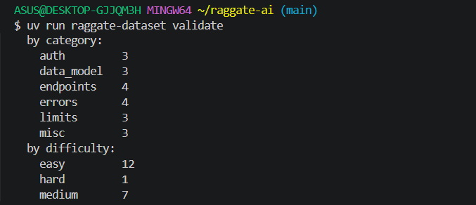
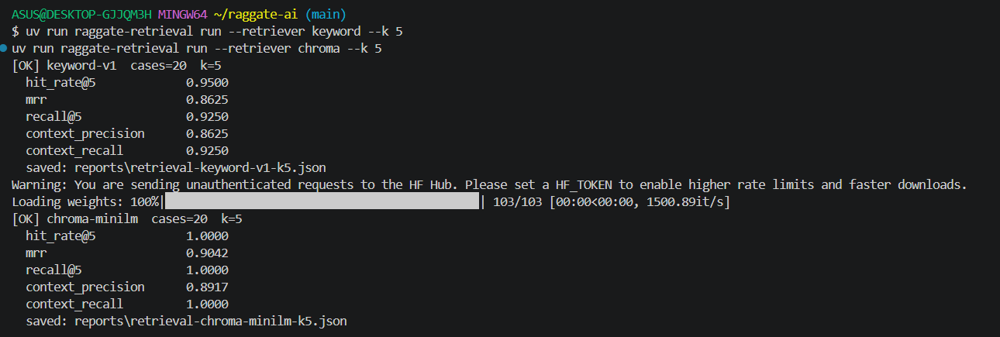
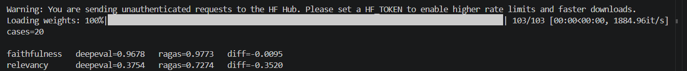
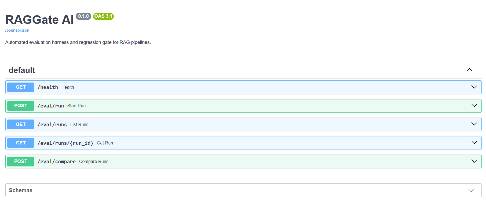
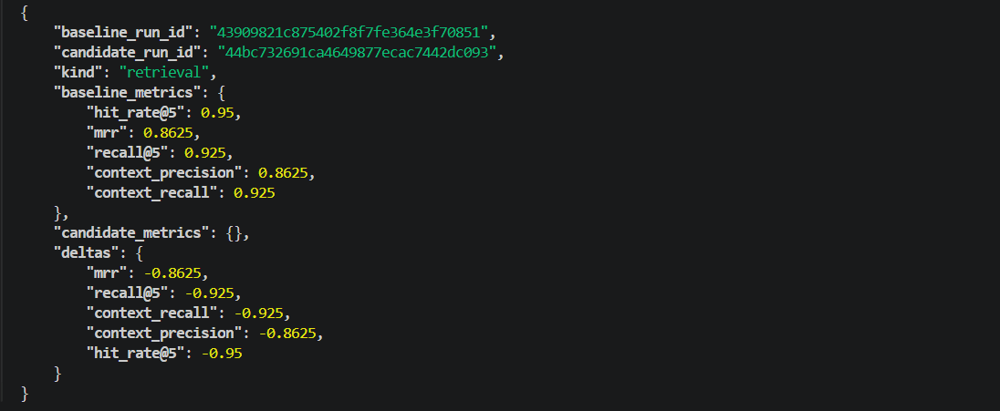
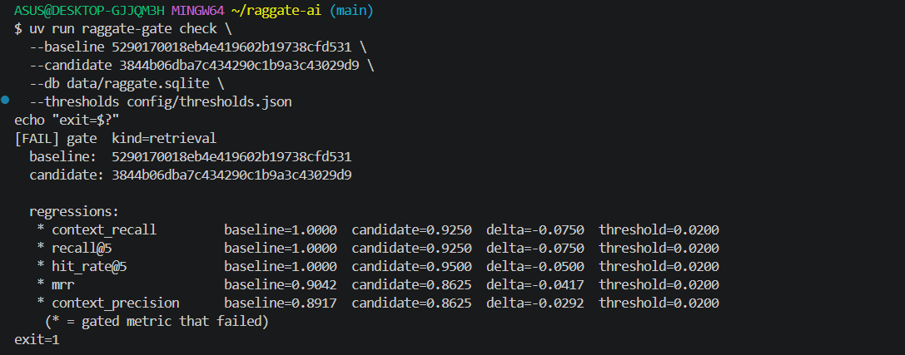
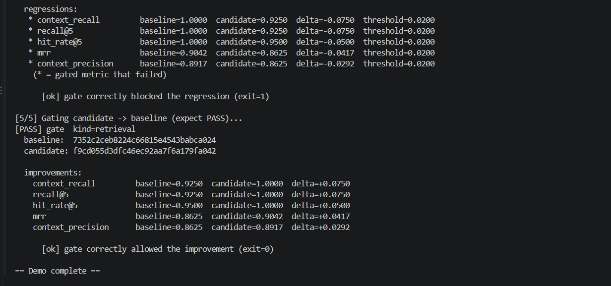
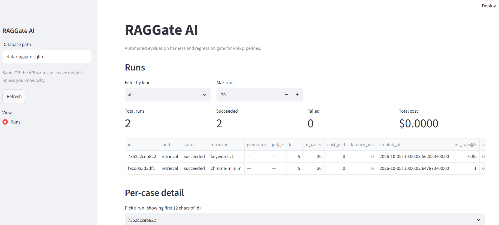
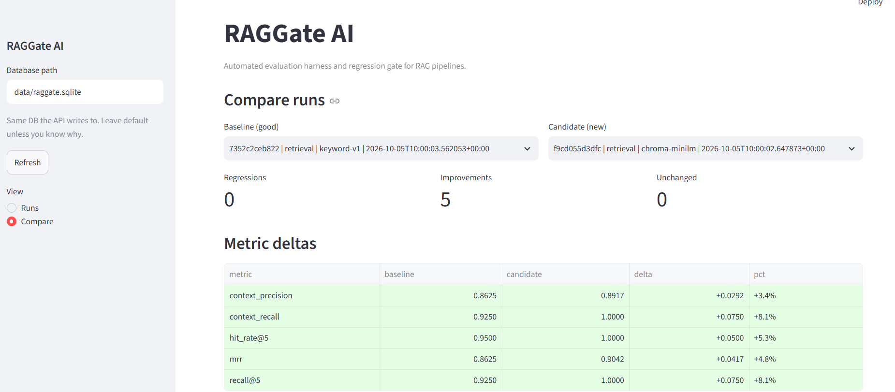
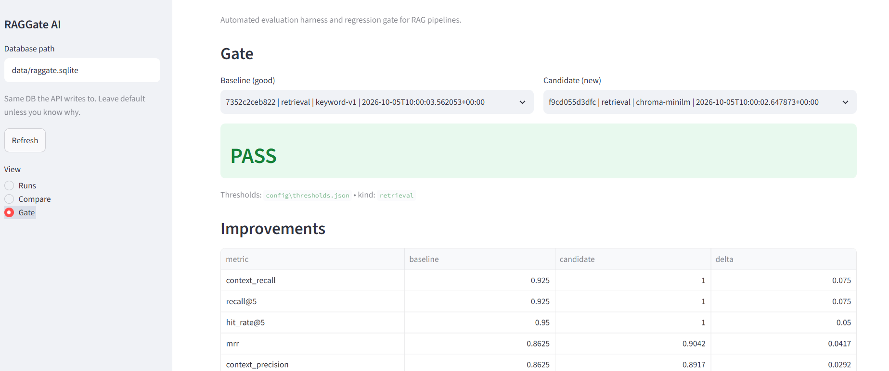

# RAGGate AI

**An automated evaluation harness and regression gate for production RAG pipelines.**

RAGGate AI scores the retrieval and generation quality of a RAG pipeline against a golden dataset, then enforces a regression gate in CI — so quality drops are caught before they ship.

> **Status:** Phase 6 complete — Streamlit dashboard with Runs, Compare, and Gate views. CI integration lands in Phase 7.

---

## Why

RAG pipelines degrade silently. A prompt tweak, an embedding model swap, or a chunker change can quietly tank answer quality without breaking a single test. RAGGate AI turns "does this RAG pipeline still work?" into a measurable, enforceable signal:

- **Scores** retrieval (hit-rate@k, MRR, context precision/recall) and generation (faithfulness, answer relevancy, correctness).
- **Gates** quality regressions by comparing a candidate run to a baseline against configurable thresholds.
- **Blocks** merges in CI when quality drops.

---

## Status

| 0 | Project skeleton & foundation | ✅ Done |
| 1 | Dataset & golden set | ✅ Done |
| 2 | Retrieval scoring | ✅ Done |
| 3 | Generation scoring | ✅ Done |
| 4 | FastAPI service | ✅ Done |
| 5 | Regression gate | ✅ Done |
| 6 | Dashboard & observability | ✅ Done |
| 7 | CI integration, polish, demo | ⏳ Next |
---

## What works today

- **Golden dataset** with 20 curated cases over an 18-chunk AcmeDB corpus, validated by a CLI.
- **Five retrieval metrics** — hit-rate@k, MRR, recall@k, context precision, context recall — with hand-computed tests.
- **Three generation metrics** — faithfulness, answer relevancy, answer correctness — scored by DeepEval and cross-checked against RAGAS.
- **Two retrievers** — keyword baseline (negative control) and Chroma + MiniLM embeddings.
- **HTTP service** with run persistence, background execution, list/fetch, and side-by-side comparison.
- **Regression gate** with configurable thresholds, a CI-facing CLI, and a one-command demo.
- **Streamlit dashboard** with Runs, Compare, and Gate views, reading from the same SQLite store.
---

## The Dataset

RAGGate AI evaluates against a **golden set**: a curated list of questions, each with a ground-truth answer and the corpus chunks that should be retrieved to answer it.

Two files under `data/`:

- **`data/corpus/acmedb.jsonl`** — the retrieval corpus. 18 short doc chunks for *AcmeDB*, a fictional managed SQL database with a REST API.
- **`data/golden/golden.jsonl`** — 20 golden cases spread across six categories: `auth`, `endpoints`, `data_model`, `limits`, `errors`, and `misc`.

Each golden case has this shape:

```json
{
  "id": "errors-004",
  "question": "Why am I getting a 429, and what should I do about it?",
  "expected_answer": "You have exceeded the 100 requests-per-minute rate limit. Wait and retry with exponential backoff (base 500 ms, max 5 retries).",
  "expected_chunk_ids": ["chunk-limits-01", "chunk-errors-03"],
  "category": "errors",
  "difficulty": "hard",
  "notes": "Cross-cutting: needs both the limits chunk and the retry-guidance chunk."
}
```

Most cases reference a single expected chunk. A few are deliberately **cross-cutting**, referencing two chunks, so retrieval metrics have to handle multi-source ground truth.


### Validating the golden set

```bash
uv run raggate-dataset validate
```



The loader fails loudly and precisely — bad lines are reported with their line number and the specific schema violation, and the command exits non-zero so it's CI-friendly.

---

## Retrieval Metrics

RAGGate AI scores retrieval with five metrics. All are computed from ID-based ground truth (`expected_chunk_ids` in the golden set) — no LLM judge involved, so they're fast, deterministic, and free.

| Metric | What it asks | Range |
|---|---|---|
| **hit-rate@k** | On what fraction of questions did we find at least one correct chunk in the top k? | 0.0 – 1.0 |
| **MRR** | Where did the *first* correct chunk land in the ranking? | 0.0 – 1.0 |
| **recall@k** | What fraction of the expected chunks made it into the top k? | 0.0 – 1.0 |
| **context precision** | Of the chunks we retrieved, how many were relevant? (rank-weighted) | 0.0 – 1.0 |
| **context recall** | Same as recall@k, named RAGAS-style for cross-checking. | 0.0 – 1.0 |

### Two retrievers, one negative control

The harness ships with two retrievers so the metrics can be validated against a known-good and a known-weak baseline:

- **`keyword`** — token-overlap baseline. Deterministic, no dependencies, intentionally weak. Acts as a **negative control**: if the harness can't detect this retriever's failures, the harness is broken.
- **`chroma`** — sentence-embedding retriever over the same corpus (`all-MiniLM-L6-v2`, cosine similarity). Should clearly beat keyword.

```bash
uv run raggate-retrieval run --retriever keyword --k 5
uv run raggate-retrieval run --retriever chroma  --k 5
```



Two things the comparison shows:

1. **The keyword baseline fails visibly.** Questions like *"How do I authenticate?"* return zero chunks — the corpus says *"authenticates"*, and token overlap misses it. The metrics catch this: `hit_rate@5` and `context_precision` drop meaningfully.
2. **The embedding retriever closes the gap.** Same corpus, same golden set, same metrics — only the retrieval method changed. That's the harness doing its job.

Every run writes a JSON report to `reports/`, containing both the aggregate metrics and the per-case detail. Those JSON files are what the regression gate (Phase 5) will compare.
---

## Generation Metrics

Retrieval metrics tell you whether the *right chunks* came back. Generation metrics tell you whether the *answer* is any good. These require an **LLM judge** — a model that reads the answer alongside the question and context and scores it.

RAGGate AI supports three generation metrics via two independent judge backends (DeepEval and RAGAS), with `gpt-4o-mini` as the judge model.

| Metric | What it asks |
|---|---|
| **Faithfulness** | Is the answer supported by the retrieved context? (Catches hallucination.) |
| **Answer relevancy** | Does the answer actually address the question? |
| **Answer correctness** | Does the answer match the reference answer? (DeepEval only — RAGAS 0.4 dropped this metric.) |

Every judge call tracks **cost** and **latency**, because in production those matter as much as the score. A full 20-case run with three generation metrics takes roughly **7 minutes** and costs **~$0.01** with `gpt-4o-mini`.

### Two judges, one cross-check

Because LLM-judged metrics are *approximations* rather than ground truth, RAGGate AI ships with two independent judge backends — DeepEval and RAGAS — and runs the same inputs through both:

| Metric | DeepEval | RAGAS | Δ |
|---|---|---|---|
| Faithfulness | 0.9678 | 0.9773 | −0.0095 |
| Answer relevancy | 0.3754 | 0.7274 | −0.3520 |

**Faithfulness agrees almost exactly** — both frameworks operationalize "supported by context" the same way, and the scores confirm the template generator is highly faithful (it copies context verbatim).

**Relevancy diverges by 0.35.** Both frameworks are "right" — they just define relevancy differently. DeepEval generates candidate questions from the answer and scores how well they match the original question; RAGAS uses synthetic-question cosine similarity. The template generator ignores the question entirely, so a stricter relevancy metric sees it as less relevant than a lenient one does.

The honest takeaway: **an LLM-judged score is only meaningful alongside the rubric that produced it.** Cross-checking against a second framework is cheap and worth doing.



### A note on non-determinism

Rerunning the same generation evaluation produces slightly different scores. In two back-to-back runs, DeepEval's answer relevancy on the same inputs moved from 0.3409 to 0.3754. This is inherent to LLM-as-judge — the model is stochastic. It's why the regression gate (Phase 5) uses **thresholds** rather than exact equality, and why the dashboard (Phase 6) shows run-over-run trends rather than single points.

---
## Service API

Everything above is exposed over HTTP. Runs are persisted to SQLite, and clients can start a run, poll its status, fetch its full report, and compare two runs side by side.

| Endpoint | Method | What it does |
|---|---|---|
| `/health` | GET | Service health and version. |
| `/eval/run` | POST | Start an evaluation run. Returns a `run_id` immediately (202). |
| `/eval/runs` | GET | List recent runs, newest first. Filter with `?kind=retrieval\|generation`, cap with `?limit=N`. |
| `/eval/runs/{run_id}` | GET | Fetch a run's summary plus every per-case result. |
| `/eval/compare` | POST | Compare two runs' metrics, return per-metric deltas. |



### Background execution

A generation run takes 5–10 minutes. `POST /eval/run` doesn't block — it inserts a `pending` run record, schedules the work as a background task, and returns the run ID immediately. Clients poll `GET /eval/runs/{id}` to see status transition through `pending → running → succeeded` (or `failed`, with the error message stored on the record).

### Compare in action

The same two retrievers from Phase 2, now compared over HTTP:

```bash
curl -X POST http://127.0.0.1:8000/eval/compare \
  -H "Content-Type: application/json" \
  -d '{"baseline_run_id":"<keyword-run>","candidate_run_id":"<chroma-run>"}'
```



Every metric moves in the right direction: `hit_rate@5`, `mrr`, `recall@5`, `context_precision`, and `context_recall` all improve when the retriever changes from keyword overlap to embeddings. **This is the seed of the regression gate** — Phase 5 adds thresholds so the endpoint returns a pass/fail verdict instead of raw numbers.

### Persistence

Runs and per-case results are stored in SQLite via a `RunStore` interface. The concrete `SQLiteRunStore` is the only implementation today; a Postgres implementation is a drop-in (the API layer only knows the interface). The database lives at `data/raggate.sqlite` by default, configurable via `RAGGATE_DB_PATH`.

---

## The Regression Gate

Retrieval and generation metrics tell you what the quality *is*. The gate tells you whether a change is **allowed to ship**.

Given two stored runs — a baseline and a candidate — the gate compares their metrics against configurable thresholds and returns a pass/fail verdict. It's exposed three ways:

- **HTTP**: `POST /eval/gate`
- **CLI**: `raggate-gate check --baseline <id> --candidate <id>`
- **One-command demo**: `bash scripts/demo_gate.sh`

### How it works

Thresholds are **max allowed absolute drops** per metric, stored in `config/thresholds.json`:

```json
{
  "retrieval": {
    "hit_rate@5": 0.02,
    "mrr": 0.02,
    "recall@5": 0.02,
    "context_precision": 0.02,
    "context_recall": 0.02
  },
  "generation": {
    "faithfulness": 0.10,
    "answer_relevancy": 0.15,
    "answer_correctness": 0.15
  }
}
```

A metric **fails the gate** if `baseline - candidate > threshold`. Metrics without an explicit threshold are reported but can't fail the gate — adding a new metric to the harness shouldn't silently start blocking builds.

Retrieval thresholds are tight (0.02) because retrieval metrics are deterministic. Generation thresholds are looser (0.10–0.15) because LLM-judged metrics vary run to run even on identical inputs — we measured ~0.03 noise between runs of the same setup in Phase 3.

### Why thresholds live in a file

A PR that loosens a threshold is a PR that changes what the gate catches. Putting thresholds in version control makes that change **visible in review** instead of buried in a shell command. This is a small thing that matters a lot in practice — gate config that isn't reviewed eventually becomes gate config nobody understands.

### CI-facing CLI

```
$ raggate-gate check --baseline <id> --candidate <id>
[FAIL] gate  kind=retrieval
  baseline:  5290170018eb4e419602b19738cfd531
  candidate: 3844b06dba7c434290c1b9a3c43029d9

  regressions:
   * context_recall    baseline=1.0000  candidate=0.9250  delta=-0.0750  threshold=0.0200
   * recall@5          baseline=1.0000  candidate=0.9250  delta=-0.0750  threshold=0.0200
   * hit_rate@5        baseline=1.0000  candidate=0.9500  delta=-0.0500  threshold=0.0200
   * mrr               baseline=0.9042  candidate=0.8625  delta=-0.0417  threshold=0.0200
   * context_precision baseline=0.8917  candidate=0.8625  delta=-0.0292  threshold=0.0200

$ echo $?
1
```

Exit codes: `0` pass, `1` regression, `2` error. That's what a GitHub Actions step needs to block a merge.



### The whole story in one command

```bash
bash scripts/demo_gate.sh
```

The script:
1. Starts the API server and waits for health
2. Runs the chroma retriever as baseline
3. Runs the keyword retriever as candidate (a real regression)
4. Gates baseline → candidate and asserts `exit=1`
5. Gates candidate → baseline and asserts `exit=0`
6. Kills the server on exit



### Two lessons the gate taught us

**1. The gate refuses to judge unfinished work.** Early in Phase 5, we hit a case where a pending run was gated against a completed one. Because pending runs have empty metrics, the gate happily reported "everything improved!" — nonsense. Fixed by returning HTTP 409 if either run's status isn't `succeeded`. Comparing against incomplete data is worse than not comparing at all.

**2. Threshold tuning is the hard part.** At `k=3`, chroma-vs-keyword produces a 0.05 drop on `hit_rate@3` and a 0.04 drop on `mrr` — right on the edge of a 0.05 threshold. Whether that counts as a regression is a judgment call the threshold encodes. Too tight, and every noise fluctuation fails the build. Too loose, and real regressions slip through. This is why the harness treats thresholds as **config, not code** — so a team can tune them per metric without touching the gate logic.

---

## Dashboard

A Streamlit dashboard provides a human-readable view of everything the API and CLI produce. It reads from the same SQLite store the API writes to — no LLM calls, no cost, no separate database.

```bash
make dashboard
# → http://localhost:8501
```

Three views:

### Runs

Recent runs in a sortable table with a KPI row (total / succeeded / failed / cost). Click any run to see its per-case results.



### Compare

Pick a baseline and a candidate. Deltas are shown per metric with red/green row highlighting and a summary banner. This is the visualization of `POST /eval/compare` — the view a reviewer would open before approving a change.



### Gate

Same two-run selection, but with **thresholds applied** — it runs the same `evaluate_gate` function the API and CLI use and shows a green **PASS** or red **FAIL** verdict, plus the regressions table. This is the same verdict CI would produce, rendered for a human.



### A note on the choice of Streamlit

Grafana is a stronger observability tool, and it was the right choice for a project like AegisAI where the *point* was production monitoring. For RAGGate AI, the dashboard is a developer aid — "what has the harness been doing?" Streamlit renders that with a single Python file and zero infrastructure, which is the right tradeoff here.

### Known limitation

The dashboard opens a SQLite connection to the same file the API writes to. If the API writes a new run while the dashboard is open, the dashboard may show stale data until the page is refreshed or the app is restarted. This is a small Streamlit + SQLite quirk, acceptable for a developer tool. A production dashboard would read through the API instead of the DB directly — a natural future iteration.

---

## Stack

| Concern | Choice |
|---|---|
| Package manager | uv |
| API | FastAPI + Uvicorn |
| Settings | pydantic-settings |
| Data validation | Pydantic v2 |
| Tests | pytest |
| Lint / format | ruff |
| Storage | SQLite |
| Evaluation | DeepEval, RAGAS |
| Dashboard | Streamlit |
| CI | GitHub Actions |

---

## Quickstart

```bash
# Clone
git clone git@github.com:elbimbo29/raggate-ai.git
cd raggate-ai

# Install
uv sync --extra dev

# Run tests
make test

# Validate the golden set
uv run raggate-dataset validate

# Boot the API
make dev
# → http://127.0.0.1:8000/docs
```

---

## Layout

```
raggate-ai/
├── src/raggate/          # application code
│   ├── dataset/          # Phase 1 — golden set + corpus
│   ├── main.py           # FastAPI app
│   └── config.py         # settings
├── tests/                # test suite
├── docs/                 # screenshots (real files, no Mermaid)
├── data/
│   ├── corpus/           # AcmeDB source documents
│   └── golden/           # golden dataset
├── reports/              # eval outputs (gitignored)
├── scripts/              # one-off helpers
├── Makefile
└── pyproject.toml
```

---

## License

MIT